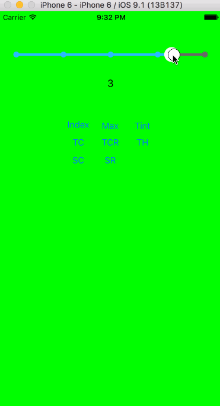
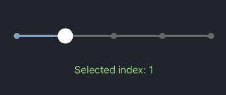

# StepSlider

StepSlider its custom implementation of slider such as `UISlider` for preset values. Behind the scenes StepSlider manipulate integer indexes. Its based on drawing directlyon `CAShapeLayer`. 



## Usage

You can add StepSlider right from code with any of standard initialisers. Or you can add it directly on your storybord. Its fully `IBDesignable` and `IBInspetable` compatible.

```objec
StepSlider *slider = [[StepSlider alloc] initWithFrame:CGRectMake(10.f, 200.f, 300.f, 44.f)];
[slider setMaxCount:10];
[slider setIndex:2];
[self.view addSubview:slider];
```

StepSlider can be fully customised by any of this properties:

- `trackHeight`
- `trackCircleRadius`
- `sliderCircleRadius`
- `dotsInteractionEnabled`
- `trackColor`
- `sliderCircleColor`
- `sliderCircleImage`

#### Labels

From version 1.0.0 StepSlider support labels near each circle on track. 

```obje
slider.labels = @[@"Some string", @"another string", @"one more"];
```



`slider.adjustLabel` - set first and last label to exactly to frame left and right.

## Requirements

- iOS 7.0+
- Xcode 8

## Installation

### CocoaPods

Add `pod 'StepSlider'` to your Podfile. 

### Manual Installation

Just copy `StepSlider` class to your project.

## License

StepSlider is available under the MIT license. See the LICENSE file for more info.