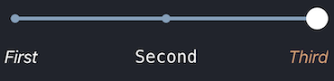

# StepSlider

StepSlider its custom implementation of slider such as `UISlider` for preset values. Behind the scenes StepSlider manipulate integer indexes. Its based on drawing directlyon `CAShapeLayer`. 


## Usage

You can add StepSlider right from code with any of standard initialisers. Or you can add it directly on your storybord. Its fully `IBDesignable` and `IBInspetable` compatible.

```objc
StepSlider *slider = [[StepSlider alloc] initWithFrame:CGRectMake(10.f, 200.f, 300.f, 44.f)];
[slider setMaxCount:10];
[slider setIndex:2];
[self.view addSubview:slider];
```

StepSlider can be fully customised by any of this properties:

- `trackHeight`
- `trackCircleRadius`
- `sliderCircleRadius`
- `dotsInteractionEnabled`
- `trackColor`
- `sliderCircleColor`
- `sliderCircleImage`

Supports haptic feedback on `valueChanged:`.

#### Labels

From version `1.0.0` StepSlider support labels near each circle on track. 

```objc
slider.labels = @[@"Some string", @"another string", @"one more"];
```


`slider.adjustLabel` - set first and last label to exactly to frame left and right.

From version `1.8.0` StepSlider support `NSAttributedString` as label text.



#### Images

For `1.2.0` and higher you can use images for `sliderCircle ` and `trackCircles`. For `trackCircles` supported two states: `normal` and `selected`.

```objc
[self.sliderView setTrackCircleImage:[UIImage imageNamed:@"unselected_dot"] forState:UIControlStateNormal];
[self.sliderView setTrackCircleImage:[UIImage imageNamed:@"selected_dot"] forState:UIControlStateSelected];
```


## Requirements

- version `1.3.0` and above needs iOS 10.0+
- version `1.2.1` supports iOS 7.0+

## Installation

### CocoaPods

To integrate `StepSlider` into your Xcode project using CocoaPods, specify it in your `Podfile`:

```
pod 'StepSlider', '~> 1.3.0'
```

Then, run the following command:

```
$ pod install
```

### Carthage

To integrate `StepSlider` into your Xcode project using Carthage, specify it in your `Cartfile`:

```
github "spromicky/StepSlider" ~> 1.3.0
```

Run `carthage update` to build the framework and drag the built `StepSlider.framework` into your Xcode project.

### Manual Installation

Just copy `StepSlider` class to your project.

## License

StepSlider is available under the MIT license. See the LICENSE file for more info.